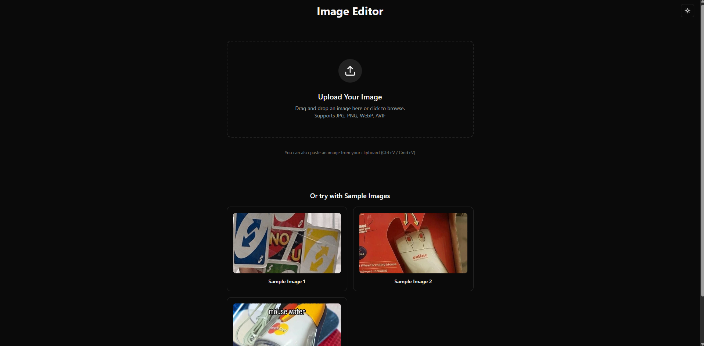
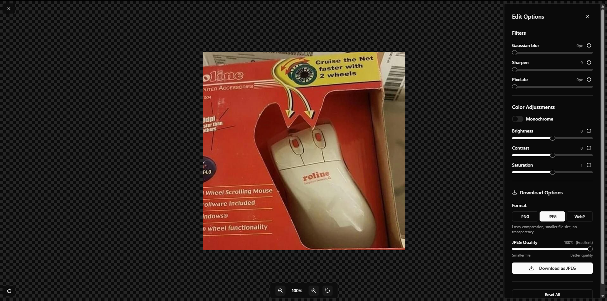

# Image Editor

University project 2025

## Run

```bash
docker compose up
```

For cpp hotreloading:

```bash
python watch_cpp_folder.py
```

## Architecture

C++ → WASM → Next.js pipeline for high-performance image processing.

### Processing Pipeline


### Architecture Layers

| Layer              | Technology          | Purpose                           | Key Files                               |
| ------------------ | ------------------- | --------------------------------- | --------------------------------------- |
| **Presentation**   | Next.js + React     | User Interface & State Management | `src/components/`                       |
| **Integration**    | TypeScript Hooks    | Bridge between UI and WASM        | `src/contexts/WasmContext.tsx`          |
| **Computation**    | C++ + WebAssembly   | High-performance image processing | `cpp/filters.cpp`, `cpp/js.cpp`         |
| **Infrastructure** | Docker + Emscripten | Build environment & compilation   | `Dockerfile.wasm`, `cpp/CMakeLists.txt` |

### How It Works

1. C++ image processing functions compiled to WASM
2. React app loads WASM module dynamically
3. User interactions call C++ functions via WASM
4. Real-time image processing with near-native performance

## Screenshots





## Deployment

```bash
git clone https://github.com/szyraf/Image-editor.git
cd Image-editor/
sudo bash deploy.sh
```

open port 3000 on your server
